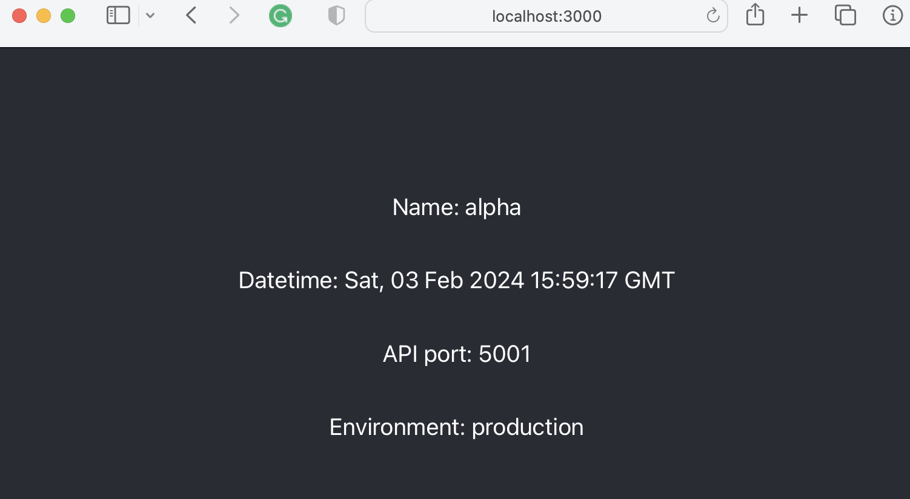

# React Flask API with Docker Deployment <!-- omit from toc -->

# Contents <!-- omit from toc -->
- [Introduction](#introduction)
- [Project Directory Structure](#project-directory-structure)
- [Flask API (Backend)](#flask-api-backend)
  - [Setup the Flask API Environment](#setup-the-flask-api-environment)
  - [Flask API](#flask-api)
- [React Client/Frontend](#react-clientfrontend)
  - [Create the React App](#create-the-react-app)
  - [Proxy](#proxy)
  - [App.js - Fetching data from the API](#appjs---fetching-data-from-the-api)
- [Run the Application on your Local Dev Machine](#run-the-application-on-your-local-dev-machine)
- [Build the React Client](#build-the-react-client)
- [Dockerize](#dockerize)
- [References](#references)


# Introduction

The goal of this exercise is to demonstrate how to create and deploy a React application ("client) with a Flask (API) backend and dockerize it into a single container. The overall application has simple functionality to keep the focus on the overall process.

All the files discussed below are available in the github repo [React Flask API with Docker Deployment](https://github.com/Aljgutier/react_flask). 

# Project Directory Structure
As we begin it is helpful to have an idea of the project directory structure. This directory structure will be created as the project is developed. 

```text
react_flask
   |
   +-- flask_api
   |     |
   |     +-- server.py
   |     +-- wsgi.py
   |     +-- .flaskenv
   |     +-- requirements.txt   
   |     +-- venv
   |           |
   |           ...
   |
   +-- react_client
         |
         + src
             |
             +-- App.js
             +-- package.json
             +-- build
             |    |
             |     ...
              ...
            
```
* note -  the overall directory structure and significant files are illustrated above. Not every file and directory is shown.
# Flask API (Backend)

## Setup the Flask API Environment


From the top-level project directory. Create the flask_api (i.e., backend) directory.

```sh
$ mkdir flask_api
$ cd react_client
```

In the `react_client`` directory create the Python virtual environment


```sh
$ python -m venv venv
$ source venv/bin/activate
$ pip install flask python-dotenv gunicorn
```

## Flask API

The backend (API) functionality is contained in the`server.py` file.

```python
# Imports
from flask import Flask
import os
import datetime
 
x = datetime.datetime.now()
 
# Get Environment Varialbles
FLASK_ENV = os.environ.get('FLASK_ENV')
FLASK_RUN_PORT = os.environ.get('FLASK_RUN_PORT')

# Initializing flask app ...
if FLASK_ENV == "production":
    app = Flask(__name__, static_folder='../build', static_url_path='/') # production 
else:
    app = Flask(__name__)  # development

 # Routes   
@app.errorhandler(404)
def not_found(e):
    return app.send_static_file('index.html')

@app.route('/')
def index():
    return app.send_static_file('index.html')
 
# data: name and date
@app.route('/api/data')
def get_time():
    return {
        'Name':"alpha", 
        "Date":x, 
        "Environment": FLASK_ENV,
        "Port": FLASK_RUN_PORT
        }
 
# Running app
if __name__ == '__main__':
    app.run(debug=True, port=FLASK_RUN_PORT)
```

Create the `.flaskenv` file to hold the Flask environment variables.

.flaskenv
```sh
FLASK_APP=server.py
FLASK_ENV=development
FLASK_RUN_PORT=5001
```

The default Flask port is 5000. However, in this example, we change the port to 5001, since in my case the MAC uses port 5000 for Airplay. You can easily change this to your preferred port.

The Flask `server.py` app will respond to the client through the defined route (`/api/data`). The application responds with a Name, Date, Environment, and Port. This response provides us a way to visualize some backend variables from the client. The environment and port are read from the Flask environment variables. The `date` is derived from the Python datetime.now() function when the API (Flask application) route is queried by the client.

When the Flask environment parameter (FLASK_ENV) is set to `production`, the Flask app is configured to serve the client's (React) static files (in the build folder). We will discuss this more later.

We can run the Flask application by typing (`Flask Run`) in a terminal. In a browser enter the route `http://localhost:5001/api/data` and the application will respond with the JSON data.

**Gunicorn**
The Gunicorn Python Web Server Gateway Interface (WSGI) manages the Python application and provides consistency for Python web applications to talk to each other. A common best practice is to serve Python web applications with Gunicorn. We installed Gunicorn web server into the virtual environment (above). 

Create the wsgi.py file.

wsgi.py
```python
from server import app
import os

if __name__ == "__main__":
    FLASK_RUN_PORT = os.environ.get('FLASK_RUN_PORT')
    app.run(port=FLASK_RUN_PORT)
```

To start the application run the following command in a terminal.

```sh
$ # gunicorn with 30 second timeout
$ gunicorn wsgi:app -w 2 -b 0.0.0.0:5001 -t 30
```

You can test the backend by entering `http://localhost:5001/api/data` in the browser URL. 

You should receive the following response:

```json
{"Date":"Sat, 03 Feb 2024 07:24:11 GMT","Environment":"development","Name":"alpha","Port":"5001"}
```

# React Client/Frontend

## Create the React App

At the top level above backend API, create the React application. You must have previously installed npm, node, and react.

In a terminal window run the npx-create-react app command as follows.
```sh
$ npx create-react-app react_client
```

cd to client directory

```sh
$ cd ./react_client
```


## Proxy
Add a proxy to `package.json` to set the port that the frontend (client) queries to make backend (API) requests. The React default port is 3000  and will be directed to the port indicated in the proxy for backend/API requests. Below, I set the proxy port to 5001 but you can change the port in the proxy line to 5000 if you leave the backend above at the default port of 5000.

Put the following line into the `package.json`

```js
"proxy":"http://localhost:5001/"
```

package.json
```js
{
  "name": "react_client",
  "version": "0.1.0",
  "private": true,
  "proxy":"http://localhost:5001/",
...
}
```

## App.js - Fetching data from the API

The App.js file in the ./src directory holds the functionality of the client application. Replace the contents of the default App.js created by `npx-create-react-app` with the following.

App.js
```js
// Filename - App.js
 
// Importing modules
import React, { useState, useEffect } from "react";
import "./App.css";
 
function App() {
    // usestate for setting a javascript
    // object for storing and using data
    const [data, setdata] = useState({
        name: "",
        date: "",
        environment:"",
        port:"",
    });
 
    // Using useEffect for single rendering
    useEffect(() => {
        // Using fetch to fetch the api from 
        // flask server it will be redirected to proxy
        fetch("/api/data").then((res) =>
            res.json().then((data) => {
                // Setting a data from api
                setdata({
                    name: data.Name,
                    date: data.Date,
                    environment: data.Environment,
                    port: data.Port
                });
            })
        );
    }, []);
 
    return (
        <div className="App">
            <header className="App-header">
                <p>Name: {data.name}</p>
                <p>Datetime: {data.date}</p>
                <p>API port: {data.port}</p>
                <p>Environment: {data.environment}</p>
            </header>
        </div>
    );
}
 
export default App;
```

We employ two React functions in our client application.

* `useState` - for setting data from the API and providing it to JSX for rendering.
* `useEffect` - for calling the fetch method.


The fetch() function returns a promise, so a completion callback is implemented with the then() method. This callback receives the response as `res`, and then calls the res.json() method to convert the payload to a JavaScript object. This is yet another promise, so a second then() implements another callback. This final callback receives the JSON data from the request, which is an object with our data.

The JSX functionality in the return() section of the application renders the data returned from the Flask API (backend) in the browser.

# Run the Application on your Local Dev Machine

**Start the Flask API**
* in the flask_api directory
* if Python environment is not activated, start the python environment (`source venv/bin/activate`)


Flask run
```sh
$ Flask run
```

You can also start with Python.

```sh
$ python server.py
```

**Start Flask API with Gunicorn**
Gunicorn provides us with a production-ready web server. Recall that we installed Gunicorn in the virtual environment (above). [Gunicorn](https://vsupalov.com/what-is-gunicorn/) takes care of running multiple instances of the web application (eg., w-2), making sure they are healthy and restarting them as needed, and distributing incoming requests across those instances. In addition, Gunicorn is efficient and fast since a lot of effort has gone into optimizing it. 


```sh
$  gunicorn wsgi:app w-2 -b 0.0.0.0:5001 -t 30
```

**Start the React Client**

Next, in a different terminal window in the flask_api directory run the `npm run start` command. Make sure that the flask_api is running (in a different terminal window)

```sh
$ npm run start
```

In a browser go to http://localhost:3000 and you should see the following


  

# Build the React Client

Run the build step on the React client (see below) to bundle all the source files and optimize their size for running in a production server or container. 

```sh
$ npm run build
----
File sizes after gzip:

  46.54 kB  build/static/js/main.38f89fa5.js
  1.78 kB   build/static/js/787.9e9f4ffd.chunk.js
  515 B     build/static/css/main.f855e6bc.css

The project was built assuming it is hosted at /.
You can control this with the homepage field in your package.json.

The build folder is ready to be deployed.
You may serve it with a static server:

  serve -s build

Find out more about deployment here:

  https://cra.link/deployment
```

# Dockerize

To keep things simple the React client and Flask API are put into a single image using a multi-stage build. The Flask functionally is configured to serve as the client static file server (i.e., from the build step) and also as the API serving via the corresponding API routes. The alternative is to create separate Frontend and Backend containers, followed by a Docker compose step to define and run the multi-container application.


**Dockerize the Flask API/backend**  
As a step towards an eventual single Dockerfile (client and API) let's get a little practice by first Dockerizing the Flask API (backend). Eventually, we will not use this for our production deployment, but this is useful for testing the API locally and as a step towards developing the final Dockerfile (client and API). Alternatively (for other use cases), the backend can be deployed as a microservice API serving an independently developed client App. 


Our `Docker.flask` file is in the project top directory. Make sure you are working from the project's top directory (above the flask_api directory)

Dockerfile.flask
```
FROM python:3.10-alpine
WORKDIR /api
COPY flask_api/requirements.txt flask_api/server.py flask_api/wsgi.py  .
RUN pip install -r requirements.txt

ENV FLASK_ENV development
ENV FLASK_RUN_PORT 5001
EXPOSE 5001

CMD ["gunicorn", "wsgi:app", "-w 2", "-b 0.0.0.0:5001", "-t 30"]

```

Next, build the Docker image with the following command.

```sh
$ docker build  -f Dockerfile.flask -t react-flask-api .
```

The single dot ( . ) at the end of the command sets the build context to the current directory. 

View the docker image with

```sh
$ docker image ls
----
REPOSITORY        TAG       IMAGE ID       CREATED              SIZE
react-flask-api   latest    e62b824acb4c   About a minute ago   62.9MB
```

Run the Flask API in the Docker container. 

```sh
$ docker run -p 5001:5001 react-flask-api 
```

Go to the browser and put in the api/data route and you will then get a JSON response as follows.
```
http:localhost:5001/api/data
---
{"Date":"Thu, 01 Feb 2024 02:28:56 GMT","Name":"alpha beta"}
```

Stop the container with `Ctrl-c`.

**Test the Client using the Flask Container**
With the React client running (i.e., `npm run start`) test to see that the Docker Flask API responds properly by putting in http://localhost:3000)


**Managing the Images and Containers**

When you make changes to the server.py file (or any file affecting the build) you will want to update the Docker build. In addition, to the Docker commands mentioned above, below are a few tips for managing the Docker images and containers, including listing and removing containers and images.

List Docker containers and images from which they are created.

```sh
$docker ps -a
-----
CONTAINER ID   IMAGE                 COMMAND                  CREATED        STATUS                      PORTS      NAMES
c404a505791f   react-flask-api       "gunicorn wsgi:app '…"   12 hours ago   Exited (0) 11 minutes ago              confident_bell

```

Delete the container by referencing the Container ID.

```sh
$ docker container rm <container id>
```

Remove an image with

```sh
$ docker image rm <image name>
```

**Single Production Docker Container**

Flask supports serving static files, so a logical implementation is to set up the Flask project so that it serves the React application in addition to the API routes.

We will need to point Flask's static folder to the React build directory. This is done with two Flask options, as shown below:

* `static_folder` tells Flask where is the static folder. By default, this is a static directory located in the same directory as the Flask application.  We can change it to point to build.

* `static_url_path` tells Flask what is the URL prefix for all static files, by default this is /static. We change it to `\` so that we do not need to prepend every static file with "/static".

These two parameters are set in the Flask API `server.py` file, as follows.

```python
app = Flask(__name__, static_folder='../build', static_url_path='/')
```

Also, in `server.py` we include the `/` route to served by the static index.html file (in the build directory).

```python
@app.route('/')
def index():
    return app.send_static_file('index.html')
```

Below is the Dockerfile for the single image container.

Dockerfile
```sh
##### BUILD STEP 1 ... build the react frontend
FROM node:20-alpine as build-step
WORKDIR /client
COPY react_client/package.json react_client/package-lock.json ./
COPY react_client/src ./src
COPY react_client/public ./public
RUN npm ci
RUN npm run build

##### BUILD STEP 2 ... build the API with client as static files
# CLient
FROM python:3.10-alpine
WORKDIR /client
RUN ls
COPY --from=build-step /client/build ./build
RUN ls

# API
RUN mkdir ./api
COPY flask_api/requirements.txt flask_api/server.py flask_api/wsgi.py ./api
RUN pip install -r ./api/requirements.txt
ENV FLASK_ENV production
ENV FLASK_RUN_PORT 5001

# Expose 3000 
# Workdir is the client/api
EXPOSE 3000
WORKDIR /client/api

CMD ["gunicorn", "wsgi:app", "-w 2", "-b", ":3000", "-t 10"]
```

The Dockerfile is based on a multistage build with two build steps. 
* the first build step copies the react_client to the container and builds the client
* the second build step, copies the client build artifacts from the first step, to the second step.

The second build step works as follows
*  set `./client` as the working directory and within the working directory create the `api` directory (`./client/api`)
*  copy the static client artifacts to the `build` directory (`./client/build`)
*  copy the API artifacts and pip install the packages in `regauirements.txt`
*  xet environment variables
*  expose the container port 3000 so that the client is accessible as an externally accessible port.
*  change the working directory to client/api
*  start the Flask server with Gunicorn - Flask will serve the client static files and API calls to `/api/data` route


Build the container.
```shell
$ docker build -f Dockerfile -t react-flask-single-container .
```

Run the container.

```sh
$ docker run -p 3000:3000 react-flask-single-container   
```

# References 
* Geek for Geeks, Connect React JS with Flask, https://www.geeksforgeeks.org/how-to-connect-reactjs-with-flask-api/, accessed January 27, 2024


* Miguel Grinberg, How to Dockerize a React + Flask Project, https://blog.miguelgrinberg.com/post/how-to-dockerize-a-react-flask-project, June 13, 2021, accessed January 27, 2024

* kubona Martin Yafesi, Dealing with Environment Variables in Flask, Flask Environment Variables, https://dev.to/kubona_my/dealing-with-environment-variables-in-flask-o1, August 10, 2021, accessed January 27, 2024

* React Flask in a Single Container,
https://stackoverflow.com/questions/62441899/flask-and-react-app-in-single-docker-container, May 2021, accessed on Jan 30, 2024

* Vsupilov, What is Gunicorn, and What Does it Do?, https://vsupalov.com/what-is-gunicorn/, accessed on February 4, 2024.